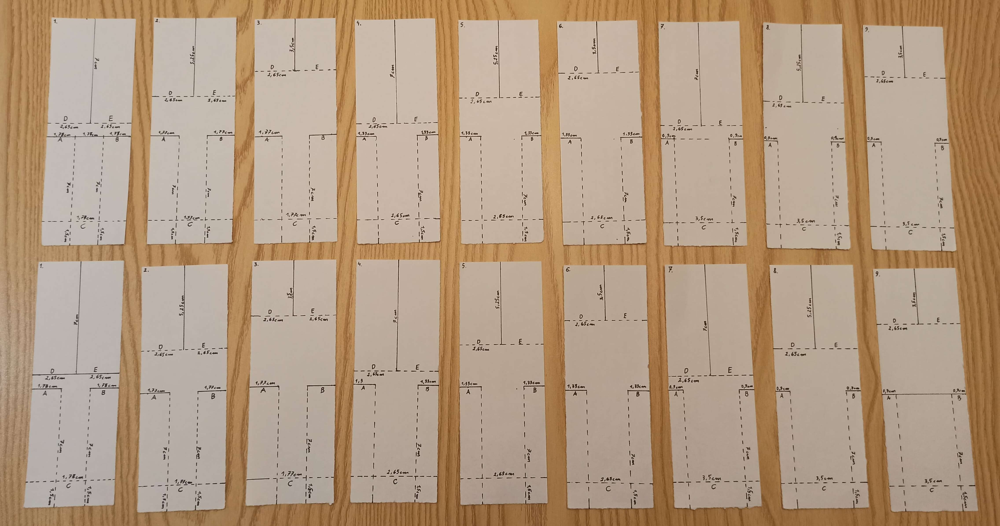
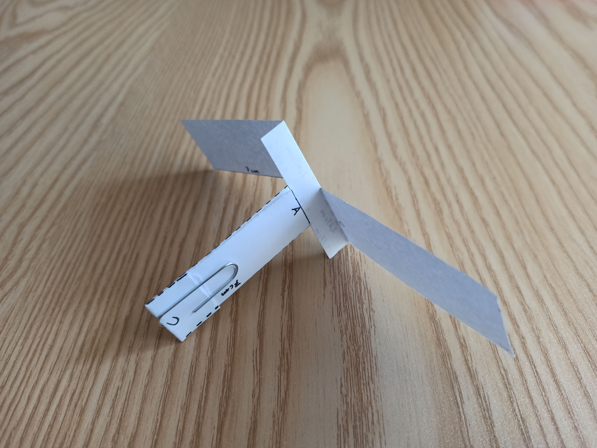

## Opis Eksperymentu

Projekt polega na przeprowadzeniu eksperymentu z papierowymi helikopterami.
Helikoptery te różnią się długościami skrzydeł oraz szerokością spodu. Długość skrzydeł,
oraz szerokość spodu są w tym przypadku czynnikami klasyfikującymi. Każdy z nich jest
podzielony na 3 poziomy. Badaną cechą w eksperymencie będzie długość lotu helikoptera.
Ponieważ mamy helikoptery składające się z 3 różnych długości skrzydeł oraz 3 różnych
szerokości spodu, istnieje zatem 9 różnych możliwych helikopterów. Każdy rodzaj
helikoptera należy wyciąć dwukrotnie co oznacza, że będziemy mieć 18 helikopterów.
Następnie dla każdego helikoptera należy wykonać 5 pomiarów czasu lotu. Aby
eksperyment miał jak największy sens, powinno się wypuszczać je z jak największej
możliwej wysokości.

 

## Przebieg eksperymentu

Zgodnie z instrukcjami i filmem instruktażowym znajdującym się pod adresem url https://www.youtube.com/watch?v=5Vk-gXwHDSM, przygotowałem 18 helikopterów. Istnieje 9 różnych rodzajów helikopterów, ale każdy z nich został wykonany liczbie sztuk 2 aby pomiar był bardziej wiarygodny. Ponieważ proces wycinania helikopterów nawet tego samego rodzaju nie jest procesem, który każdorazowo można powtórzyć z największą dokładnością i zawsze helikoptery nawet tego samego rodzaju będą się od siebie różniły w szczegółach. Wśród wyciętych helikopterów mamy 3 różne szerokości spodów i 3 różne długości skrzydeł, co łącznie daje 9 różnych kombinacji. Poniżej zostały przedstawione parametry wszystkich helikopterów. 

* 2 helikoptery  o długości skrzydeł 7 cm i szerokości  spodu 1,77 cm
* 2 helikoptery  o długości skrzydeł 5,25 cm i szerokości  spodu 1,77 cm
* 2 helikoptery  o długości skrzydeł 3,5 cm i szerokości  spodu 1,77 cm
* 2 helikoptery  o długości skrzydeł 7 cm i szerokości  spodu 2,65 cm
* 2 helikoptery  o długości skrzydeł 5,25 cm i szerokości  spodu 2,65 cm
* 2 helikoptery  o długości skrzydeł 3,5 cm i szerokości  spodu 2,65 cm
* 2 helikoptery  o długości skrzydeł 7 cm i szerokości  spodu 3,5 cm
* 2 helikoptery  o długości skrzydeł 5,25 cm i szerokości  spodu 3,5 cm
* 2 helikoptery  o długości skrzydeł 3,5 cm i szerokości  spodu 3,5 cm

 

Poniższe zdjęcie przedstawia wycięte kartki tych samych formatów na helikoptery z projektem wymiarów skrzydeł i spodów dla każdej kombinacji.

## Projekty  helikopterów

Każdy z helikopterów był spuszczany 5 razy, co daje nam 90 wyników pomiarowych. W ramach analizy należało przedstawić podstawowe statystyki, niezbędne wykresy i sprawdzić założenia do analizy wariancji. Zadania te były realizowane w następujących krokach:

* 1-czynnikowa analiza wariancji ze względu na czynnik długości skrzydła,
* 1-czynnikowa analiza wariancji ze względu na czynnik szerokości spodu,
* dwuczynnikowa analiza wariancji ze względu na czynniki długości skrzydła i szerokości spodu zarówno z interakcjami  jak i bez interakcji.

 

## Środowisko przeprowadzenia eksperymentu

Eksperyment został przeprowadzony w mieszkaniu, którego wysokość wynosi 240 cm. Dawało to możliwość zrzucania helikopterków z wysokości 230cm. Wszystkie okna i drzwi w mieszkaniu na czas zrzucania helikopterów i mierzenia czasu ich lotu były zamknięte, co minimalizowało wpływ ruchów powietrza na mieszkaniu, które mogłyby negatywnie wpłynąć na pomiary.

 

## Gotowy helikopter

## Wyniki pomiaru czasu lotu helikopterów

Oznaczenia dla poszczególnych helikopterów:
* 2 helikoptery  o długości skrzydeł 7 cm i szerokości spodu 1,77 cm -> 7x1,77
* 2 helikoptery  o długości skrzydeł 5,25 cm i szerokości spodu 1,77 cm -> 5,25x1,77
* 2 helikoptery  o długości skrzydeł 3,5 cm i szerokości spodu 1,77 cm -> 3,5x1,77
* 2 helikoptery  o długości skrzydeł 7 cm i szerokości spodu 2,65 cm -> 7x2,65
* 2 helikoptery  o długości skrzydeł 5,25 cm i szerokości spodu 2,65 cm -> 5,25x2,65
* 2 helikoptery  o długości skrzydeł 3,5 cm i szerokości spodu 2,65 cm -> 3,5x2,65
* 2 helikoptery  o długości skrzydeł 7 cm i szerokości spodu 3,5 cm -> 7x3,5
* 2 helikoptery  o długości skrzydeł 5,25 cm i szerokości spodu 3,5 cm -> 5,25x3,5
* 2 helikoptery  o długości skrzydeł 3,5 cm i szerokości spodu 3,5 cm -> 3,5x3,5

 

### Tabela czasu pomiarów

| Rodzaj helikoptera | pomiar 1 | pomiar 2 | pomiar 3 | pomiar 4 | pomiar 5 | pomiar 6 | pomiar 7 | pomiar 8 | pomiar 9 | pomiar 10 |
| ------------------ | -------- | -------- | -------- | -------- | -------- | -------- | -------- | -------- | -------- | -------- |
| 7x1,77             | 2.07     | 2.06     | 2.08     | 2.22     | 2.16     | 2.14     | 2.13     | 2.15     | 2.13     | 2.25     |
| 5,25x1,77             | 1.59     | 1.77     | 1.45     | 1.40     | 1.51     | 1.51     | 1.49     | 1.39     | 1.63     | 1.42     |
| 3,5x1,77             | 1.06     | 1.12     | 1.10     | 1.16     | 1.14     | 1.08     | 1.21     | 1.10     | 1.16     | 1.05     |
| 7x2,65             | 2.05     | 2.08     | 2.16     | 2.02     | 2.06     | 1.89     | 2.14     | 2.08     | 2.11     | 2.11     |
| 5,25x2,65             | 1.29     | 1.55     | 1.59     | 1.49     | 1.61     | 1.38     | 1.55     | 1.50     | 1.53     | 1.60     |
| 3,5x2,65             | 1.06     | 1.09     | 1.15     | 1.13     | 1.08     | 1.24     | 1.06     | 1.06     | 1.08     | 1.08     |
| 7x3,5             | 2.00     | 1.80     | 1.78     | 1.80     | 1.91     | 1.93     | 1.92     | 1.86     | 2.06     | 2.01     |
| 5,25x3,5             | 1.50     | 1.23     | 1.41     | 1.37     | 1.31     | 1.40     | 1.27     | 1.29     | 1.49     | 1.42     |
| 3,5x3,5             | 1.21     | 0.98     | 1.01     | 1.06     | 1.11     | 0.99     | 1.09     | 1.11     | 0.95     | 1.01     |

Zarówno pierwsze 5 jak i kolejne 5 pomiarów dla każdego rodzaju helikoptera zostało przeprowadzone przy użyciu innych modeli. Jednostką pomiaru czasu była sekunda

## Wstęp teoretyczny

 

### Jednoczynnikowa analiza wariancji

Jednoczynnikowa analiza  wariancji - jest to uogólniony test różnic między średnimi. Można ją rozumieć jako rozszerzenie testu t-Studenta. Test t stosujemy kiedy testujemy różnicę między dwiema średnimi. Natomiast w przypadku kiedy zmienna niezależna przybiera więcej niż 2 poziomy (testujemy różnicę dla więcej niż 2 średnich). Analiza wariancji, podobnie jak w testach t-Studenta, stosujemy zarówno w planach dla grup niezależnych jak i zależnych
  
 

W badaniu tym stawiamy dwie hipotezy. W celu ich zrozumienia omówię teraz symbole i oznaczenia:

  * r = liczba populacji
  * $σ^2$ = wariancja
  * $μ$ = wartość oczekiwana
  * $μ_i$ = gdzie $i = 1, ..., r$

 

Aby dokonać tego rodzaju analizy wariancji musimy spełnić następujące założenia:

* zmienna zależna mierzona na skali ilościowej
* każda z $r$ populacji musi mieć rozkład normalny
* próby poddawane analizie muszą być od siebie niezależne. Inaczej, założenie o jednorodności wariancji dla analizy wariancji dla grup niezależnych (jednorodność wariancji wyników oznacza, że zróżnicowanie wyników w poszczególnych grupach badawczych jest podobne).
* próby z każdej z populacji muszą być losowymi próbami prostymi. Oznacza to, że każdy element z populacji ma jednakową sznasę no to, aby znaleźć się w próbie
* wariancje w wylosowanych próbach są równe, ponieważ wówczas analiza wariancji jest odporna na zaburzenie większości założeń, np. założenie o kształcie rozkładu czy homogeniczności wariancji.

 

Z populacji $r$ losujemy niezależne próby o liczebnościach $n_i$. Na tych próbach dokonujemy obliczeń, których wynikiem są wartości $x_{ij}$ dla $i=1,...,r$ oraz $j=1,...,n_1$. Całkowita wielkość próby to $n=n_1+n_2+...+n_r$.

  W tym momencie stawiamy dwie wcześniej wspomniane hipotezy:

  * hipoteza zerowa: $H_0: μ_1=μ_2=...=μ_r$
  * hipoteza alternatywna: $H_a: nie wszystkie i są sobie równe i=(1,...,r)

 

Aby zweryfikować powyższe hipotezy obliczamy wartość statystyki F danej wzorem: 

$F=\frac{MSTR}{MSE}$

,gdzie

$MSTR=\frac{1}{r-1}\sum_{i=1}^r{n_i}{(\overline{x_i}-\hat{x})^2}$

$MSE=\frac{1}{n-r}\sum_{i=1}^r\sum_{j=1}^{n_i}{n_i}{({x_{ij}}-\overline{x_i})^2}$

,gdzie

$\overline{x_i}$ = średnia arytmetyczna z i-tej próby

$\hat{x}$ = średnia arytmetyczna ze wszystkich obserwacji ze wszystkich r prób

 

Przy założeniu poprawności hipotezy zerowej statystyka F ma rozkład F-Snedecora z $r-1$ stopniami swobody w liczniku i $n-r$ stopniami swobody w mianowniku

 

Obszar krytyczny przyjmuje postać

$Q=\{F:F\ge{F_\alpha}\}$

, gdzie

$F_\alpha$ = wartość krytyczna odczytana z tablic rozkładu F-Snedecora dla (r-1, n-r) stopni swobody.

 

Warunki przyjęcia bądź przyjęcia/odrzucenia hipotez:

* Jeśli wartość statystyki F należy do obszaru krytycznego Q to odrzucamy hipotezę zerową na rzecz alternatywnej - oznacza to, że badane średnie nie są jednorodne,

* Jeśli wartość statystyki F nie należy do obszary krytycznego Q to nie mamy podstawy do odrzucenia hipotezy zerowej - oznacza to, że badane średnie są jednorodne.

 

### Dwuczynnikowa analiza wariancji

Inaczej zwana jako ANOVA dla klasyfikacji podwójnej, bada wpływ dwóch czynników klasyfikujących, podzielonych na wiele poziomów, na wartości badanej cechy mierzalnej. Analiza powinna spełniać następujące założenia: normalność i jednorodność wariancji w próbach wyznaczonych przez czynniki klasyfikujące. W przypadku tej analizy stawiamy 3 hipotezy:

* ${H_{A0}}$ = czynnik A nie różnicuje wyników
* ${H_{B0}}$ = czynnik B nie różnicuje wyników
* ${H_{AB0}}$ = czynniki A i B nie różnicują wyników

 

## Jednoczynnikowa analiza wariancji ze względu na czynnik długości skrzydła

Zobacz: PiAE_projekt1_Jeremiasz_Macura.ipynb

 

## Jednoczynnikowa analiza wariancji ze względu na czynnik szerokość spodu

Zobacz: PiAE_projekt1_Jeremiasz_Macura.ipynb

 

## Dwuczynnikowa analiza wariancji ze względu na czynniki długości skrzydeł i szerokość spodu z interakcjami i bez interakcji

Zobacz: PiAE_projekt1_Jeremiasz_Macura.ipynb

 

## Wnioski i podsumowanie

Po przeprowadzeniu jednoczynnikowej analizy wariancji ze względu na czynnik długości skrzydła można dojść do wniosku, że długość skrzydła ma duże znaczenie na czas lotu helikoptera. Helikopter ze skrzydłem o długości 70 mm spadał dłużej od tego z długością skrzydeł 52,5 mm, a ten znów spadał dłużej od tego z długością skrzydeł 35 mm.

Analiza wariancji ze względu na czynnik szerokości spodu nie ujawniła żadnych różnic na poziomie statystycznym. Można więc stwierdzić, że szerokość spodu nie miała znaczenia na czas lotu helikoptera. Zarówno helikopter z szerokością spodu 17,7 mm spadał w podobnym czasie jak helikopter z szerokością 26,5 mm i ten z szerokością 35 mm.

Zaś wyniki dwuczynnikowej analizy wariancji wykazały znaczenie zarówno szerokości spodu jak i długości skrzydeł na czas lotu helikopterów. W przypadku dwuczynnikowej analizy wariancji z interakcjami wymienione poniżej helikoptery nie miały znaczenia dla długości lotu w porównaniu ze sobą:
* skrzydła 35 mm, spód 26.5 mm - skrzydła 35 mm, spód 17.7 mm
* skrzydła 35 mm, spód 35 mm - skrzydła 35 mm, spód 17.7 mm
* skrzydła 52,5 mm, spód 26.5 mm - skrzydła 52,5 mm, spód 17.7 mm
* skrzydła 70 mm, spód 26.5 mm - skrzydła 70 mm, spód 17.7 mm
* skrzydła 35 mm, spód 35 mm - skrzydła 35 mm, spód 26,5 mm

Reasumując długość skrzydeł ma większe znaczenie na czas lotu helikoptera niż szerokość spodu. Eksperyment został przeprowadzony w warunkach mieszkaniowych mając do dyspozycji 230 cm wysokości, z których helikoptery zostały spuszczane, co dawało krótkie czasy loty helikopterów przy których czynniki takie jak: sposób upuszczania helikoptera, refleks przy startowaniu i zatrzymywaniu helikoptera miały znaczenie. 
